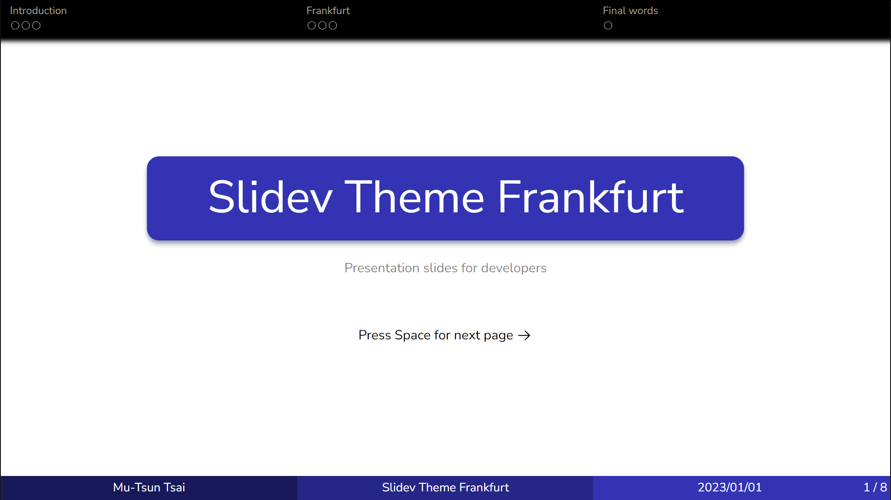

# slidev-theme-frankfurt

[](https://www.npmjs.com/package/slidev-theme-frankfurt)

A theme for [Slidev](https://github.com/slidevjs/slidev), inspired by the Frankfurt theme in [Beamer](https://github.com/josephwright/beamer), well-suited for academic talks.

<!--
  Learn more about how to write a theme:
  https://sli.dev/themes/write-a-theme.html
--->

<!--
  run `npm run dev` to check out the slides for more details of how to start writing a theme
-->



## Install

Add the following frontmatter to your `slides.md`. Start Slidev then it will prompt you to install the theme automatically.

```yaml
---
theme: frankfurt
infoLine: true # on by default, can be turned off
author: 'Your name here' # shows in infoLine
title: 'Title' # shows in infoLine
date: '2023/01/01' # shows in infoLine, defaults to the current date
---
```

Learn more about [how to use a theme](https://sli.dev/themes/use).

## Using sections

The main feature of Frankfurt theme is the section and progress indicators on top. To divide your slides into sections, add the following frontmatter to the first page of each section:

```yaml
---
section: 'Section title'
---
```

## Components

This theme provides the following component:

```html
<Item title="Title of your thing">
	Create a box for definitions, lemmas, theorems, etc.
</Item>
```


## Contributing

- `npm install`
- `npm run dev` to start theme preview of `example.md`
- Edit the `example.md` and style to see the changes
- `npm run export` to generate the preview PDF
- `npm run screenshot` to generate the preview PNG
